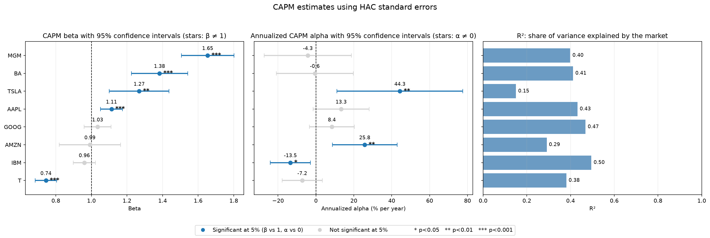
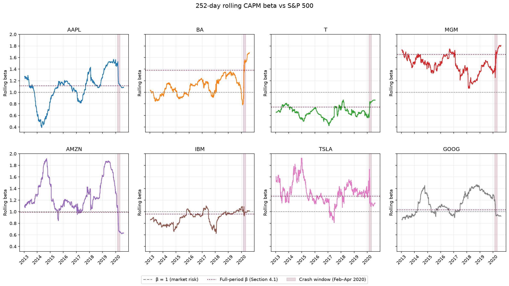
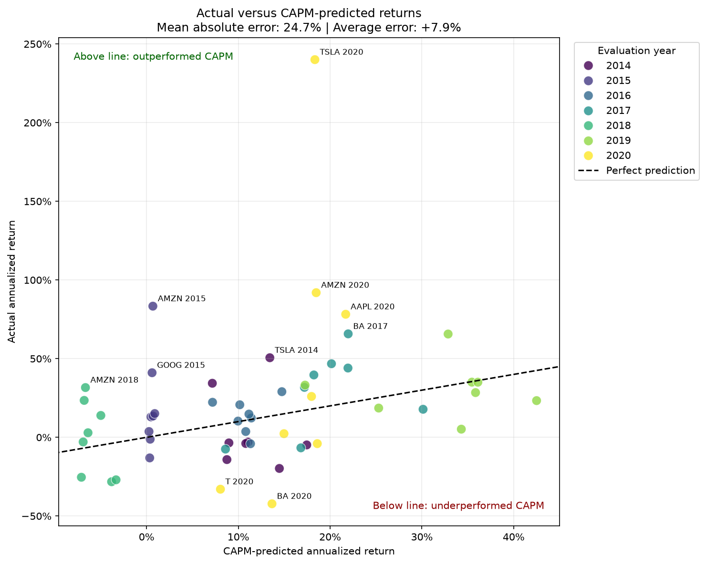
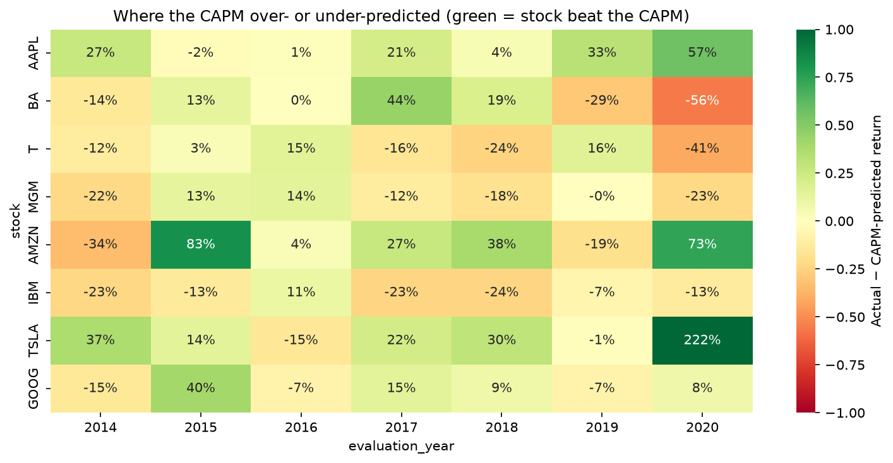
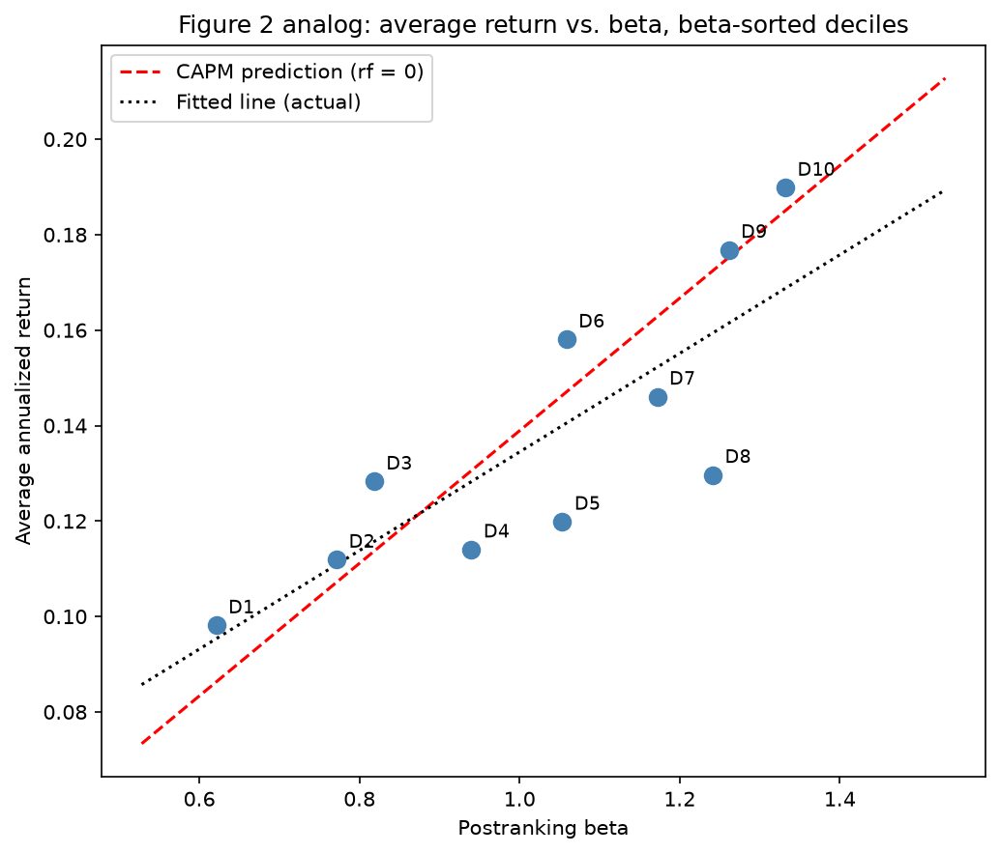
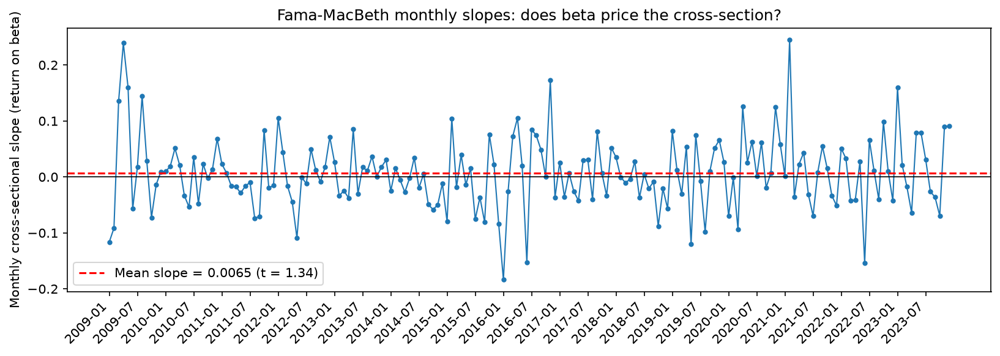

# Testing the CAPM on US Equities: From Eight Stocks to the S&P 500 Cross-Section

Empirical tests of the Capital Asset Pricing Model (CAPM) in Python. The project estimates market betas and alphas for eight large US stocks (2012–2020), checks whether prior-year betas explain realized returns, and then extends the test to the full S&P 500 universe using a survivorship-bias-free CRSP panel (2007–2023) with beta-sorted portfolios, Fama–MacBeth regressions and the Gibbons–Ross–Shanken (GRS) test.

> **Status:** completed team project (4 authors), originally developed as coursework in an MSc finance course at Bocconi University. See [Authors](#authors-and-contributions) and [Disclaimer](#disclaimer).

---

## Research question

Does market beta explain the returns of US stocks, as the CAPM predicts?

In practice this breaks into three questions that matter to anyone who uses beta for risk management, cost-of-equity estimates or portfolio construction:

1. How much of a single stock's risk is market risk, and how precisely can beta be measured?
2. Does a beta estimated last year tell you how a stock will perform this year, given the market's return?
3. Across hundreds of stocks grouped into portfolios, is the relation between beta and average return as steep as the CAPM implies?

## Key findings

| # | Finding | Evidence |
|---|---------|----------|
| 1 | **Beta is estimated precisely, but explains a minority of daily risk.** Full-period betas range from 0.74 (T) to 1.65 (MGM), all significant; the market explains only 15–50% of daily return variance. | OLS with Newey–West (HAC) standard errors, 8 stocks, 2012–2020 |
| 2 | **Most alphas are zero, as the CAPM predicts, with three exceptions.** TSLA (+44% p.a.) and AMZN (+26% p.a.) earned significantly more than their market risk implied; IBM (−13.5% p.a.) significantly less. These are *ex-post* results, not exploitable forecasts. | HAC t-tests on annualized daily alpha |
| 3 | **Prior-year beta is a poor guide to a single stock's return in a given year.** Mean absolute error of 24.7 percentage points; errors are persistent by firm (TSLA, AMZN, AAPL above; IBM below), pointing to omitted risk factors. Better beta estimates do not fix this: errors stay around 25 pp for 3-month to 2-year estimation windows. | Annual rebalancing test, 2014–2020 |
| 4 | **With diversified portfolios, the beta–return relation becomes clean.** Ten beta-sorted deciles (~470 S&P 500 stocks per year, 2010–2023) have post-ranking betas from 0.62 to 1.33 and average returns rising from 9.8% to 19.0% p.a. The fitted security market line is slightly flatter than the CAPM line, in the direction documented by Fama and French (2004), but only weakly. | Value-weighted decile portfolios, CRSP |
| 5 | **Formal tests do not reject the CAPM on beta-sorted portfolios, but the beta premium is not significant either.** GRS F = 1.15 (p = 0.32); Fama–MacBeth beta premium 0.65% per month (t = 1.34). The tests where the literature most clearly rejects the CAPM (book-to-market and size sorts) could not be run with the available data. | GRS (1989); Fama–MacBeth (1973), 180 months |

**Bottom line:** beta is a meaningful, measurable exposure to market risk, and higher-beta portfolios did earn more on average over this period. It is not, on its own, a reliable predictor of what an individual stock will return in a given year.

---

## Selected results

**Full-sample CAPM estimates (HAC standard errors)**



**Beta is not constant: 252-day rolling betas**



**CAPM-predicted vs. realized annual returns (prior-year beta)**



**Prediction errors are persistent by firm**



**Security market line on beta-sorted decile portfolios (S&P 500, 2010–2023)**



**Fama–MacBeth monthly cross-sectional slopes**



All 15 figures produced by the notebook are in [`figures/`](figures/).

---

## Data

| Dataset | Content | Period | Used in | Included in repo? |
|---------|---------|--------|---------|-------------------|
| Eight-stock price file | Daily closing prices of AAPL, BA, T, MGM, AMZN, IBM, TSLA, GOOG and the S&P 500 price index | 12 Jan 2012 – mid-2020 | Parts 1–3 | **No** (course-provided file) |
| CRSP daily stock file, S&P 500 constituents | ~2.15 million stock-days, 873 distinct firms (PERMNO), total returns incl. dividends, market cap, price flags | 2007–2023 | Part 4 | **No** (licensed via WRDS) |

**Why CRSP rather than Wikipedia + Yahoo Finance.** A ticker list scraped from Wikipedia contains only *current* index members, and Yahoo Finance generally lacks price histories for delisted firms. A sample built that way over-represents survivors and overstates average returns. CRSP includes every firm that was in the index during the sample, including later delistings, with a permanent identifier that survives ticker changes.

**Data-access limitations.** Neither dataset can be redistributed here. The notebook is committed *with its outputs*, so all tables and charts can be read on GitHub without the data. See [`data/README.md`](data/README.md) for how to obtain equivalent data and where to place it.

---

## Methodology

**Returns and conventions.** Simple daily returns; risk-free rate set to zero throughout (T-bill rates were near zero for most of the sample); annualization by ×252. The eight-stock prices are split-adjusted but not dividend-adjusted, so returns for high-yield stocks (T, IBM) are somewhat understated.

**Part 1 – Market exposure.** Scatter plots of daily stock vs. market returns, cumulative performance, and 63-day rolling correlations, with the February–April 2020 COVID crash highlighted.

**Part 2 – Full-sample CAPM.** For each stock, OLS of daily returns on market returns. Residual diagnostics: Jarque–Bera (normality), Breusch–Pagan and White (heteroskedasticity), Breusch–Godfrey (autocorrelation, 5 lags). Inference re-estimated with Newey–West HAC standard errors. Beta tested against 1, alpha against 0. 252-day rolling betas. An equally weighted portfolio of the four highest-beta stocks compares CAPM-implied and realized returns.

**Part 3 – Predictive test.** For each year *y* (2014–2020): estimate βᵢ on the 252 trading days before 1 January of *y*; compare the stock's realized annualized return in *y* with β × (realized market return in *y*). Analyses: prediction errors, year-by-year security market lines, realized SML slope vs. market return, beta stability with confidence bands, high- vs. low-beta groups, and sensitivity to 63/126/252/504-day estimation windows.

**Part 4 – Cross-sectional extension (CRSP).** Following Fama and French (2004):
- value-weighted market proxy built from the panel with lagged market-cap weights;
- annual formation of ten value-weighted portfolios on pre-ranking betas (504 trading days, minimum 380 observations), held one year, 2010–2023;
- post-ranking betas and a security-market-line plot (analogue of Fama–French 2004, Figure 2);
- Fama–MacBeth regressions of monthly returns on annually re-estimated betas (2009–2023);
- GRS test that all ten decile alphas are jointly zero.

---

## Repository structure

```
capm-empirical-tests-sp500/
├── README.md
├── LICENSE
├── requirements.txt
├── .gitignore
├── notebooks/
│   └── capm_empirical_tests.ipynb   # full analysis, committed with outputs
├── figures/                         # 15 PNG charts exported from the notebook
├── data/
│   └── README.md                    # how to obtain the data (no data files committed)
└── references/
    └── README.md                    # academic references
```

## Technologies

Python 3.11 · pandas · NumPy · statsmodels (OLS, HAC, diagnostic tests) · SciPy · Matplotlib · seaborn · Jupyter · CRSP via WRDS

## Reproducing the analysis

```bash
git clone https://github.com/ceciliaalocicero/capm-empirical-tests-sp500.git
cd capm-empirical-tests-sp500
python -m venv .venv
source .venv/bin/activate        # Windows: .venv\Scripts\activate
pip install -r requirements.txt
```

1. Obtain the data as described in [`data/README.md`](data/README.md) and place the files in `data/raw/`.
2. Launch Jupyter (`jupyter lab`) and open `notebooks/capm_empirical_tests.ipynb`.
3. Check the file names and parameters in the **Setup and configuration** cell.
4. Run all cells (*Run → Run All Cells*). Parts 1–3 need only the eight-stock file; Part 4 needs only the CRSP file.

If you rebuild the eight-stock data from a different source (e.g. Yahoo Finance), expect small numerical differences from the committed outputs.

## Limitations

- **Risk-free rate set to zero**, so returns are raw rather than excess returns; this mainly affects intercepts.
- **Market proxy.** Parts 1–3 use the S&P 500 price index (no dividends); Part 4 uses a value-weighted index of S&P 500 constituents. Neither is the true market portfolio (Roll, 1977).
- **Small, non-random sample in Parts 1–3:** eight well-known stocks, several of them large ex-post winners, over one long bull market.
- **2020 is a partial year** (data end mid-2020), dominated by the COVID crash and rebound; annualized 2020 figures should be read with care.
- **Price-only returns** in the eight-stock data understate returns of high-dividend stocks.
- **Large caps only in Part 4**, so size effects cannot be studied; **no book equity** (Compustat), so the book-to-market test was not replicated.
- **Daily data in the GRS test**, whose F-distribution assumes normal i.i.d. errors; residuals here are fat-tailed and heteroskedastic.
- Decile weights are fixed at formation-date market caps rather than drifting with prices; stocks leave a portfolio when they leave the index.
- Alphas are **historical, in-sample** estimates. Nothing here is a trading strategy or backtest, and transaction costs are not considered.

## Authors and contributions

Team project by **Cecilia Lo Cicero, Sara Pulidori, Alissa Sharuda and Nico Visentin**.

All four authors worked jointly on every part of the analysis. Repository prepared and maintained by **Cecilia Lo Cicero**.

Developed as coursework for *Finance with Big Data* (MSc, Bocconi University). The assignment framework was provided by the course; the analysis, extensions and write-up are the team's own.

## References

- Black, F., Jensen, M. C., & Scholes, M. (1972). The capital asset pricing model: Some empirical tests. In M. C. Jensen (Ed.), *Studies in the Theory of Capital Markets* (pp. 79–121). Praeger.
- Fama, E. F., & French, K. R. (2004). The capital asset pricing model: Theory and evidence. *Journal of Economic Perspectives*, 18(3), 25–46.
- Fama, E. F., & MacBeth, J. D. (1973). Risk, return, and equilibrium: Empirical tests. *Journal of Political Economy*, 81(3), 607–636.
- Frazzini, A., & Pedersen, L. H. (2014). Betting against beta. *Journal of Financial Economics*, 111(1), 1–25.
- Gibbons, M. R., Ross, S. A., & Shanken, J. (1989). A test of the efficiency of a given portfolio. *Econometrica*, 57(5), 1121–1152.
- Lintner, J. (1965). The valuation of risk assets and the selection of risky investments in stock portfolios and capital budgets. *Review of Economics and Statistics*, 47(1), 13–37.
- Newey, W. K., & West, K. D. (1987). A simple, positive semi-definite, heteroskedasticity and autocorrelation consistent covariance matrix. *Econometrica*, 55(3), 703–708.
- Roll, R. (1977). A critique of the asset pricing theory's tests. *Journal of Financial Economics*, 4(2), 129–176.
- Sharpe, W. F. (1964). Capital asset prices: A theory of market equilibrium under conditions of risk. *Journal of Finance*, 19(3), 425–442.
- Center for Research in Security Prices (CRSP), accessed via Wharton Research Data Services (WRDS).

## Disclaimer

This is an educational project. It does not constitute investment advice or a recommendation to buy or sell any security. All results are historical and in-sample; past performance does not predict future returns. Raw data are not distributed because of licensing restrictions.

## License

Code is released under the [MIT License](LICENSE). Data are not included and remain subject to their providers' terms.
